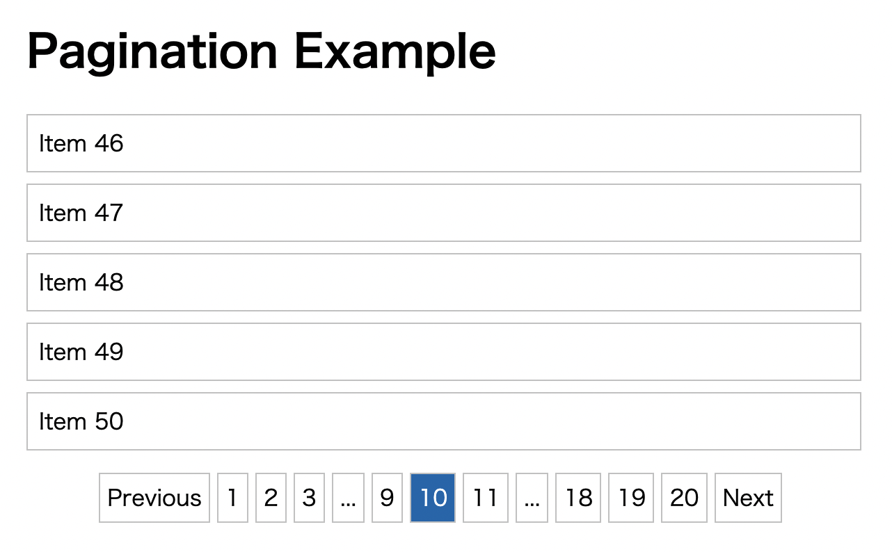

## react-paginate のソースコードの解説

以前、react-paginate を使ってページネーションを実装したことがあったのですが、どのようなソースコードが書かれているのか気になって調べてみました。このレポジトリはソースコードについての自分用のメモです。

ちなみに、このライブラリを使うことで実装できるデモ画像


このようなページネーションを実現できます

### react-paginate の使い方

以下は react-paginate の README.md ファイルから引用

```
import React, { useEffect, useState } from 'react';
import ReactDOM from 'react-dom';
import ReactPaginate from 'react-paginate';

// Example items, to simulate fetching from another resources.
const items = [1, 2, 3, 4, 5, 6, 7, 8, 9, 10, 11, 12, 13, 14];

function Items({ currentItems }) {
  return (
    <>
      {currentItems &&
        currentItems.map((item) => (
          <div>
            <h3>Item #{item}</h3>
          </div>
        ))}
    </>
  );
}

function PaginatedItems({ itemsPerPage }) {
  const [itemOffset, setItemOffset] = useState(0);

  const endOffset = itemOffset + itemsPerPage;
  console.log(`Loading items from ${itemOffset} to ${endOffset}`);
  const currentItems = items.slice(itemOffset, endOffset);
  const pageCount = Math.ceil(items.length / itemsPerPage);

  const handlePageClick = (event) => {
    const newOffset = (event.selected * itemsPerPage) % items.length;
    console.log(
      `User requested page number ${event.selected}, which is offset ${newOffset}`
    );
    setItemOffset(newOffset);
  };

  return (
    <>
      <Items currentItems={currentItems} />
      <ReactPaginate
        breakLabel="..."
        nextLabel="next >"
        onPageChange={handlePageClick}
        pageRangeDisplayed={5}
        pageCount={pageCount}
        previousLabel="< previous"
        renderOnZeroPageCount={null}
      />
    </>
  );
}

// Add a <div id="container"> to your HTML to see the component rendered.
ReactDOM.render(
  <PaginatedItems itemsPerPage={4} />,
  document.getElementById('container')
);
```

## 概要

react-paginate の github を覗いてみると、「react_components」というフォルダがあるのですが、ページネーションに関する処理はこちらのフォルダに書かれています。そのフォルダの中には主に 5 つのファイルがあります。

1. PageView.js - このファイルはページを表示させるファイルです
2. BreakView.js - BreakView.js 　- このファイルは省略記号(上の画像で言うと、3 ページ目と 57 ページ目の間に表示されている「...」という記号)を表示させるファイルです
3. PaginationBoxView.js 　- このファイルはページネーションの実装を行なっている部分です。BreakView.js ファイルと PageView.js ファイルはここで呼び出されています

では PageView.js、BreakView.js、最後に PaginationBoxView.js ファイルの順番でコードを見てみましょう。ちなみに、ファイル内では PropsTypes を使用していますが、そこの記述はほとんど省略しています。

### PageView.js ファイル

```
import React from 'react';
import PropTypes from 'prop-types';

const PageView = (props) => {
  let { pageClassName, pageLinkClassName } = props;
  const {
    page,
    selected,
    activeClassName,
    activeLinkClassName,
    getEventListener,
    pageSelectedHandler,
    href,
    extraAriaContext,
    pageLabelBuilder,
    rel,
  } = props;

  let ariaLabel =
    props.ariaLabel ||
    'Page ' + page + (extraAriaContext ? ' ' + extraAriaContext : '');
  let ariaCurrent = null;

  if (selected) {
    ariaCurrent = 'page';

    ariaLabel = props.ariaLabel || 'Page ' + page + ' is your current page';

    if (typeof pageClassName !== 'undefined') {
      pageClassName = pageClassName + ' ' + activeClassName;
    } else {
      pageClassName = activeClassName;
    }

    if (typeof pageLinkClassName !== 'undefined') {
      if (typeof activeLinkClassName !== 'undefined') {
        pageLinkClassName = pageLinkClassName + ' ' + activeLinkClassName;
      }
    } else {
      pageLinkClassName = activeLinkClassName;
    }
  }

  return (
    <li className={pageClassName}>
      <a
        rel={rel}
        role={!href ? 'button' : undefined}
        className={pageLinkClassName}
        href={href}
        tabIndex={selected ? '-1' : '0'}
        aria-label={ariaLabel}
        aria-current={ariaCurrent}
        onKeyPress={pageSelectedHandler}
        {...getEventListener(pageSelectedHandler)}
      >
        {pageLabelBuilder(page)}
      </a>
    </li>
  );
};

export default PageView;
```

様々な props が渡されているとは思いますが、最も重要なのは「pageSelectedHandler」、「selected」と「pageLabelBuilder」、「page」、「getEventListener」、「pageLabelBuilder」です。a タグには「aria-label」、「aria-current」が渡されていますが、これらはスクリーンリーダーを利用するユーザーのためのものです。スクリーンリーダーは主に目の不自由な方、視覚障がい者が使うもので、要するにアクセシビリティを高めるために渡していると思われます。他にも「rel」属性が渡されていますが、これは SEO 対策をする上でつけることが望ましいとされているものです。「{...getEventListener(pageSelectedHandler)}」はイベントをアタッチしています

### BreakView.js ファイル

```
const BreakView = (props) => {
  const {
    breakLabel,
    breakAriaLabel,
    breakClassName,
    breakLinkClassName,
    breakHandler,
    getEventListener,
  } = props;
  const className = breakClassName || 'break';

  return (
    <li className={className}>
      <a
        className={breakLinkClassName}
        role="button"
        tabIndex="0"
        aria-label={breakAriaLabel}
        onKeyPress={breakHandler}
        {...getEventListener(breakHandler)}
      >
        {breakLabel}
      </a>
    </li>
  );
};

BreakView.propTypes = {
  breakLabel: PropTypes.oneOfType([PropTypes.string, PropTypes.node]),
  breakAriaLabel: PropTypes.string,
  breakClassName: PropTypes.string,
  breakLinkClassName: PropTypes.string,
  breakHandler: PropTypes.func.isRequired,
  getEventListener: PropTypes.func.isRequired,
};

export default BreakView;
```

こちらは「breakLabel」が最も重要で、省略記号を設定しています。「{...getEventListener(pageSelectedHandler)}」でイベントをアタッチしているのは PageView.js ファイルと同様です。ちなみに、省略記号はユーザー側で変更できます。最初の方に react-paginate の使い方を書きましたが、breakLabel に渡す文字列を変更することで省略記号を変更できます。

```
<ReactPaginate
        // 以下のbreakLabelの値を変更することで省略記号を変更できます
        breakLabel="..."
        以下省略
/>
```

### PaginationBoxViewjs ファイル

先の PageView.js ファイルと BreakView.js ファイルとは異なり、PaginationBoxView.js 　ファイルは 600 行以上もあります。そのため、重要だと思う箇所を抜粋して説明することにします。

```
import React, { Component } from 'react';
import PropTypes from 'prop-types';
import PageView from './PageView';
import BreakView from './BreakView';
import { classNameIfDefined } from './utils';

export default class PaginationBoxView extends Component {
  static propTypes = {
    pageCount: PropTypes.number.isRequired,
    以下は省略
  };

  static defaultProps = {
    pageRangeDisplayed: 2,
    marginPagesDisplayed: 3,
    activeClassName: 'selected',
    previousLabel: 'Previous',
    previousClassName: 'previous',
    previousAriaLabel: 'Previous page',
    prevPageRel: 'prev',
    prevRel: 'prev',
    nextLabel: 'Next',
    nextClassName: 'next',
    nextAriaLabel: 'Next page',
    nextPageRel: 'next',
    nextRel: 'next',
    breakLabel: '...',
    breakAriaLabels: { forward: 'Jump forward', backward: 'Jump backward' },
    disabledClassName: 'disabled',
    disableInitialCallback: false,
    pageLabelBuilder: (page) => page,
    eventListener: 'onClick',
    renderOnZeroPageCount: undefined,
    selectedPageRel: 'canonical',
    hrefAllControls: false,
  };

  constructor(props) {
  ...
  }

  componentDidMount() {
  ...
  }

  componentDidUpdate(prevProps) {
   ...
  }

  以下一部省略
  ...
  
  getElementHref(pageIndex) {
   ...
  }


  getPageElement(index) {
    ...
  }

  pagenation = () => {
    ...
  }

  render() {

    return (
        <ul
        className={className || containerClassName}
        role="navigation"
        aria-label="Pagination"
      >
        <li className={previousClasses}>
          <a
            className={previousLinkClasses}
            href={this.getElementHref(selected - 1)}
            tabIndex={isPreviousDisabled ? '-1' : '0'}
            role="button"
            onKeyPress={this.handlePreviousPage}
            aria-disabled={previousAriaDisabled}
            aria-label={previousAriaLabel}
            rel={prevRel}
            {...this.getEventListener(this.handlePreviousPage)}
          >
            {previousLabel}
          </a>
        </li>

        {this.pagination()}

        <li className={nextClasses}>
          <a
            className={nextLinkClasses}
            href={this.getElementHref(selected + 1)}
            tabIndex={isNextDisabled ? '-1' : '0'}
            role="button"
            onKeyPress={this.handleNextPage}
            aria-disabled={nextAriaDisabled}
            aria-label={nextAriaLabel}
            rel={nextRel}
            {...this.getEventListener(this.handleNextPage)}
          >
            {nextLabel}
          </a>
        </li>
      </ul>
    )
  }
}

```

実はこのファイルでは関数コンポーネントではなくクラスコンポーネントで書かれています。そして、以上のような Props がデフォルトで定義されています。多くの Props がありますが、本当に必要なものは pageCount と onPageChange くらいで、他は defaultProps がよしなにやってくれます。では重要だと思う箇所のみを解説します。

まず、最も重要なのは constructor 内のコードです

```
  constructor(props) {
    super(props);

    let initialSelected;
    if (props.initialPage) {
      initialSelected = props.initialPage;
    } else if (props.forcePage) {
      initialSelected = props.forcePage;
    } else {
      initialSelected = 0;
    }

    this.state = {
      selected: initialSelected,
    };
  }
```

上記の記述は、特に使用者側が特定の props(initailPage か forcePage に任意の値)を渡さなければ、0 が渡されます。特に難しいことをしているわけではなく、関数コンポーネントでいうなら

```
const [selected, setSelected] = useState(0)
```

と書いているようなものです。

componentDidMount や componentDidUpdate 内の処理に関してはそれほど気にしなくても大丈夫です。ソースコードを見ればわかるのですが、適切な props が渡されているのかを確認し、意図しない props が渡された場合(例えば pageCount には整数が渡されるはずなのだが、整数ではない値が渡された場合など)には console.warn で警告を出しているだけです。

次に、いきなりですが最後の return 文を見てみましょう

```
return (
      <ul
        className={className || containerClassName}
        role="navigation"
        aria-label="Pagination"
      >
        <li className={previousClasses}>
          <a
            className={previousLinkClasses}
            href={this.getElementHref(selected - 1)}
            tabIndex={isPreviousDisabled ? '-1' : '0'}
            role="button"
            onKeyPress={this.handlePreviousPage}
            aria-disabled={previousAriaDisabled}
            aria-label={previousAriaLabel}
            rel={prevRel}
            {...this.getEventListener(this.handlePreviousPage)}
          >
            {previousLabel}
          </a>
        </li>

        一部省略
        ...

        <li className={nextClasses}>
          <a
            className={nextLinkClasses}
            href={this.getElementHref(selected + 1)}
            tabIndex={isNextDisabled ? '-1' : '0'}
            role="button"
            onKeyPress={this.handleNextPage}
            aria-disabled={nextAriaDisabled}
            aria-label={nextAriaLabel}
            rel={nextRel}
            {...this.getEventListener(this.handleNextPage)}
          >
            {nextLabel}
          </a>
        </li>
      </ul>
    );
```

このコードの 2 つの li タグは


前者は上記の画像で言うと「Previous」ボタンを、後者は上記の画像でいうと「Next」ボタンを生成しています。このボタンの中身の文字列は使用者側が決めることもできます。

```
  <ReactPaginate
        一部省略
        ...
        nextLabel="次のページへ"
        previousLabel="前のページへ"
      />
```

このように書くことで、


このようにボタンの文字列を「Previous」から「前のページへ」、「Next」から「次のページへ」に変えることができました。

そして、2 つの li タグの間にある中身の pagination メソッドはどのような処理がされているのかをみてみましょう。この pagination メソッドによりページや省略記号を作成しています。

```
 pagination = () => {
    const items = [];
    const {
      pageRangeDisplayed,
      pageCount,
      marginPagesDisplayed,
      breakLabel,
      breakClassName,
      breakLinkClassName,
      breakAriaLabels,
    } = this.props;

    const { selected } = this.state;

    if (pageCount <= pageRangeDisplayed) {
      for (let index = 0; index < pageCount; index++) {
        items.push(this.getPageElement(index));
      }
    } else {
      let leftSide = pageRangeDisplayed / 2;
      let rightSide = pageRangeDisplayed - leftSide;

      if (selected > pageCount - pageRangeDisplayed / 2) {
        rightSide = pageCount - selected;
        leftSide = pageRangeDisplayed - rightSide;
      } else if (selected < pageRangeDisplayed / 2) {
        leftSide = selected;
        rightSide = pageRangeDisplayed - leftSide;
      }

      let createPageView = (index) => this.getPageElement(index);
      let index;
      let breakView;


      const pagesBreaking = [];
      for (index = 0; index < pageCount; index++) {
        const page = index + 1;

        if (page <= marginPagesDisplayed) {
          pagesBreaking.push({
            type: 'page',
            index,
            display: createPageView(index),
          });
          continue;
        }

        if (page > pageCount - marginPagesDisplayed) {
          pagesBreaking.push({
            type: 'page',
            index,
            display: createPageView(index),
          });
          continue;
        }

        const adjustedRightSide =
          selected === 0 && pageRangeDisplayed > 1 ? rightSide - 1 : rightSide;

        if (
          index >= selected - leftSide &&
          index <= selected + adjustedRightSide
        ) {
          pagesBreaking.push({
            type: 'page',
            index,
            display: createPageView(index),
          });
          continue;
        }

        if (
          breakLabel &&
          pagesBreaking.length > 0 &&
          pagesBreaking[pagesBreaking.length - 1].display !== breakView &&
          (pageRangeDisplayed > 0 || marginPagesDisplayed > 0)
        ) {
          const useBreakAriaLabel =
            index < selected
              ? breakAriaLabels.backward
              : breakAriaLabels.forward;
          breakView = (
            <BreakView
              key={index}
              breakAriaLabel={useBreakAriaLabel}
              breakLabel={breakLabel}
              breakClassName={breakClassName}
              breakLinkClassName={breakLinkClassName}
              breakHandler={this.handleBreakClick.bind(null, index)}
              getEventListener={this.getEventListener}
            />
          );
          pagesBreaking.push({ type: 'break', index, display: breakView });
        }
      }

      pagesBreaking.forEach((pageElement, i) => {
        let actualPageElement = pageElement;
        if (
          pageElement.type === 'break' &&
          pagesBreaking[i - 1] &&
          pagesBreaking[i - 1].type === 'page' &&
          pagesBreaking[i + 1] &&
          pagesBreaking[i + 1].type === 'page' &&
          pagesBreaking[i + 1].index - pagesBreaking[i - 1].index <= 2
        ) {
          actualPageElement = {
            type: 'page',
            index: pageElement.index,
            display: createPageView(pageElement.index),
          };
        }
        items.push(actualPageElement.display);
      });
    }

    return items;
  };
```

このようになっています。一つずつ見ていきましょう。

```
    const items = [];
```

このようにして、最初に items と言う配列を作成します

```
    const {
      pageRangeDisplayed,
      pageCount,
      marginPagesDisplayed,
      breakLabel,
      breakClassName,
      breakLinkClassName,
      breakAriaLabels,
    } = this.props;
```

そして、上記の props を取得します。使用者から特に props が渡されなかったら上に書いた defultProps が渡されます(上で使う props のみを表示させています)。

```
static defaultProps = {
    pageRangeDisplayed: 2,
    marginPagesDisplayed: 3,
    breakLabel: '...',
    breakAriaLabels: { forward: 'Jump forward', backward: 'Jump backward' },
  };
```

breakLabelClassName と breakLinkClassName に関しては使用者側から特に指定しなければ null になっているはずです。

ここで pageRangeDisplayed と marginPagesDisplayed について説明しておきましょう

pageRangeDisplayed は**表示されるページの範囲**を示しています。pageRangeDisplayed はデフォルトでは 2 ですが、それを 4 にしてみました。以下がその画像です。


下記は pageRangeDisplayed がデフォルト値の 2 だった場合の画像です


pageRangeDisplayed が 4 の場合だと、8 ページ目から 12 ページ目まで、4 つ分のページが表示されているのに対し、2 が渡される場合では 9 ページ目から 11 ページ目までの 2 つ分のページしか表示されていません。つまり、現在選択されているページの前後に pageRangeDisplayed に渡した数値分だけページ番号が表示されます。

次に marginPagesDiplayed ですが、これは**ページネーションの左端と右端に表示されるページ番号の数を指定するもの**です。例えば、デフォルトでは 3 が渡されていますが、これを 5 にしてみましょう。以下がその画像です。


下記は marginPagesDisplayed がデフォルト値の 3 だった場合です。


marginPagesDisplayed が 5 の場合だと、左端が 1 ページ目から 5 ページ目まで、右端が 16 ページ目から 20 ページ目まで、それぞれ 5 つ分のページが表示されているのに対し、デフォルト値の 3 を渡している場合では左端が 1 ページ目から 3 ページ目、右端は 18 ページ目から 20 ページ目までしか表示されません。

少し脱線しましたが、pagination メソッド内の処理を再びみてみましょう。

```
  const { selected } = this.state;
```

最初に定義した selected ステートを取得します。

```
  if (pageCount <= pageRangeDisplayed) {
      for (let index = 0; index < pageCount; index++) {
        items.push(this.getPageElement(index));
      }
    }
```

ちなみに、getPageElementメソッドについて説明がありませんでしたが、中身自体は簡単で、単にPageViewコンポーネントを返しているだけです。

もし、pageCount が pageRangeDisplayed 以下だったら 1 から pageCount の数値までのページネーションを作成します。つまり、省略記号(デフォルトでは「...」)がないページネーションができるということです。

そして、

```
if (page <= marginPagesDisplayed) {
  // ページ情報をpagesBreaking配列に追加します。
  pagesBreaking.push({
    type: 'page',
    index,
    display: createPageView(index),
  });
  continue;
}
```

以上のコードで、左端のページを生成します。次に、

```
if (page > pageCount - marginPagesDisplayed) {
  // ページが右側に表示される条件に合致する場合、そのページを`pagesBreaking`に追加し、次のループに進みます。
  pagesBreaking.push({
    type: 'page',
    index,
    display: createPageView(index),
  });
  continue;
}
```

以上のコードで右端のページを生成します。例えば、20 ページが仮にあり、marginPagesDisplayed が 3 であった場合、1 ページから 3 ページ、18 ページから 20 ページを生成します。

```
if (
  index >= selected - leftSide &&
  index <= selected + adjustedRightSide
) {
  pagesBreaking.push({
    type: 'page',
    index,
    display: createPageView(index),
  });
  continue;
}
```

そして、以上のコードはページインデックスが leftSide と adjustedRightSide によって定義される範囲内であれば、それはページネーションの中央部にあると見なされ、pagesBreaking に追加されます。

```
if (
  breakLabel &&
  pagesBreaking.length > 0 &&
  pagesBreaking[pagesBreaking.length - 1].display !== breakView &&
  (pageRangeDisplayed > 0 || marginPagesDisplayed > 0)
) {
  // ブレーク要素をpagesBreaking配列に追加します。
  const useBreakAriaLabel =
    index < selected ? breakAriaLabels.backward : breakAriaLabels.forward;
  breakView = (
    <BreakView
      key={index}
      breakAriaLabel={useBreakAriaLabel}
      breakLabel={breakLabel}
      breakClassName={breakClassName}
      breakLinkClassName={breakLinkClassName}
      breakHandler={this.handleBreakClick.bind(null, index)}
      getEventListener={this.getEventListener}
    />
  );
  pagesBreaking.push({ type: 'break', index, display: breakView });
}
```

そして、以上のコードで省略記号が追加されます
```
items.push(actualPageElement.display);
```

最後に、以上のコードで、最初の方に宣言したitems配列に、PageView要素かBreakView要素が格納されます

